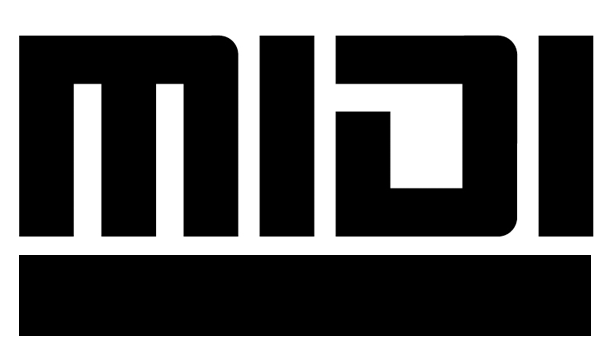
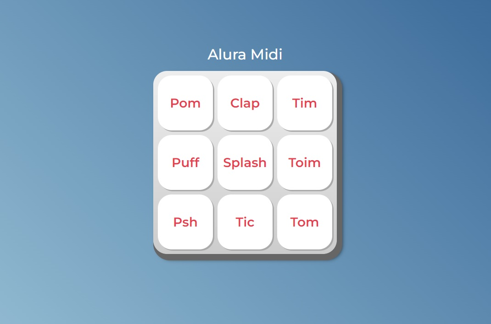

  
  <!--Adicionar logotipo do projeto aqui-->
  

    
  
 

  <h1>Alura Midi</h1>
  
Alura Midi é um instrumento musical de interface digital, onde a cada botão vamos reproduzir o som de um instrumento

  

    
  
 

  <!--Adicionar imagem/gif do projeto aqui-->
  

       
  

## 🔨 Seja um dos contribuidores 
Quer fazer parte desse projeto? Clique [AQUI](CONTRIBUTING.md) e leia como contribuir.

<a href='#voltar-topo'>⬆ Voltar ao topo</a> 

